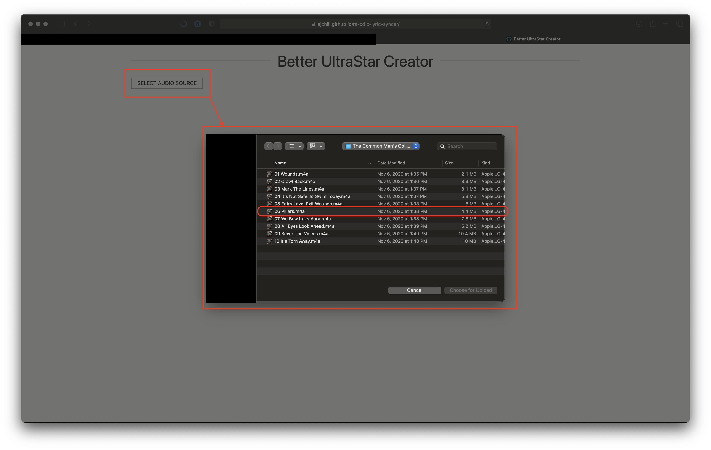
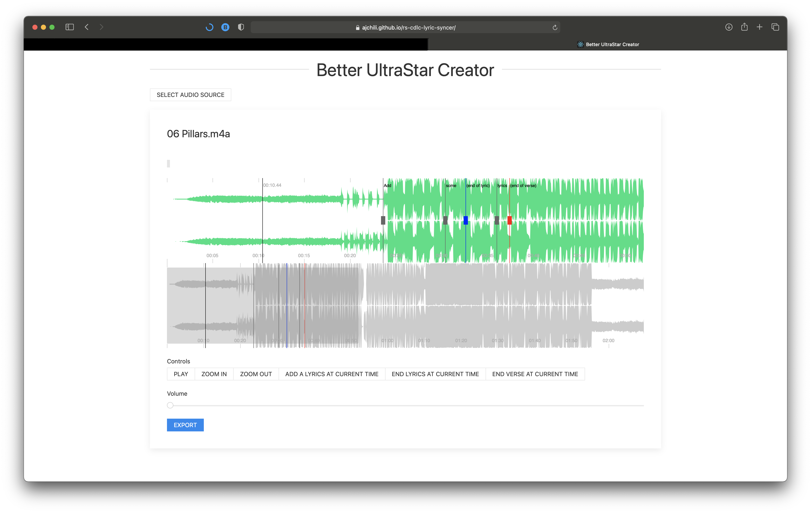
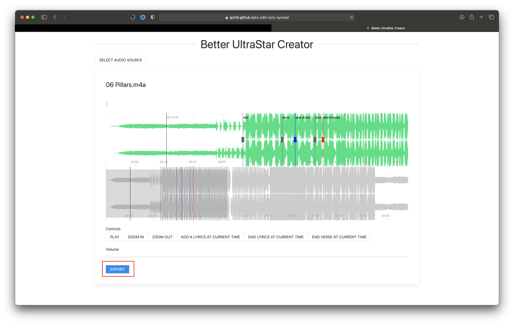
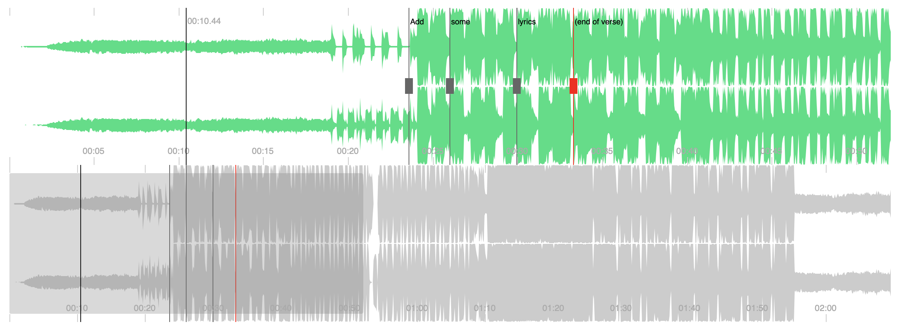
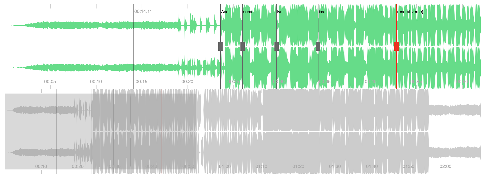

# rs-cdlc-lyric-syncer

Web application for generating lyric files used within Rocksmith 2014 CDLC.
Serves as a replacement for
[UltraStar Creator](https://github.com/UltraStar-Deluxe/UltraStar-Creator).

## How to use

1. Go to the [application](https://ajchili.github.io/rs-cdlc-lyric-syncer/)
2. Load your media file
   
3. Add lyrics

   - **H** - Add a lyric at the play head position
   - **J** - Mark the end of a lyric at the play head position
   - **K** - Mark the end of a verse at the play head position
   - **SPACE** - Play/Pause

   

4. Export to a file
   
5. You will be asked to provide a song title, artist, and BPM
6. Your lyrics will be downloaded to a text file

## Expected Lyric Syntax

- To mark the start of a verse, capitalize the first letter of the first word in
  the verse

  

- To specify syllables in a word, add a lyric per syllable, specifying a **-**
  (hyphen) at the end of each lyric

  
